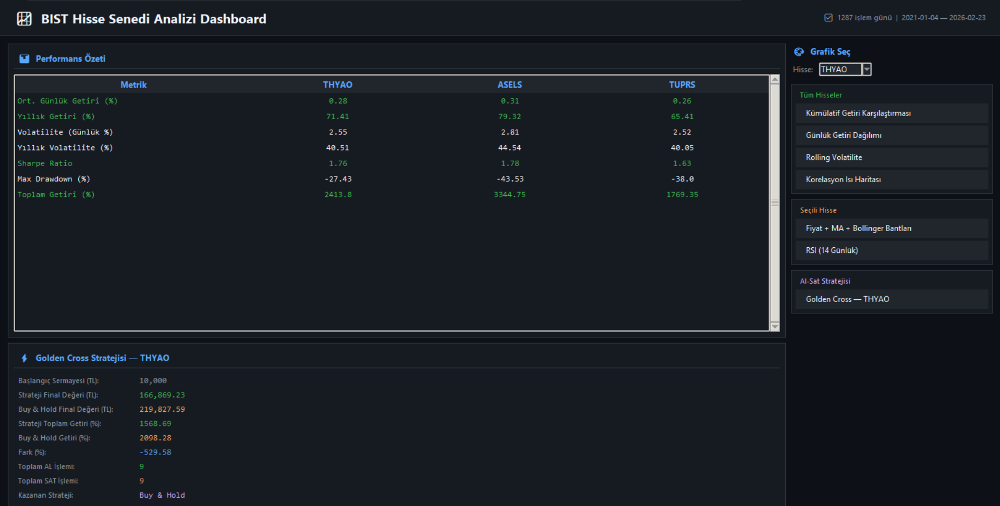
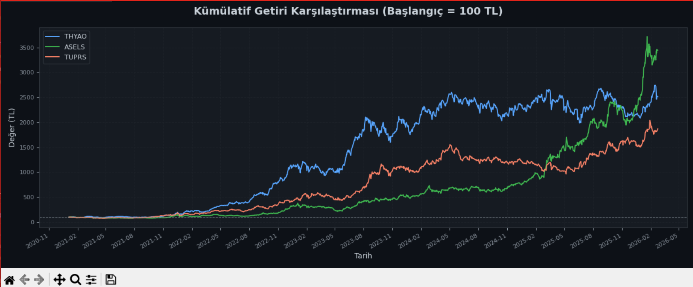
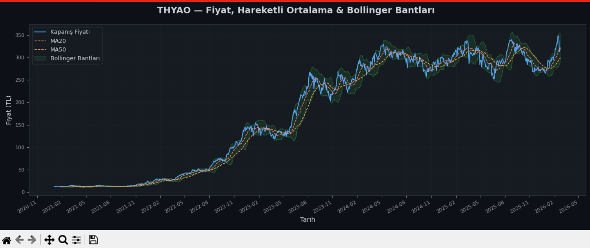
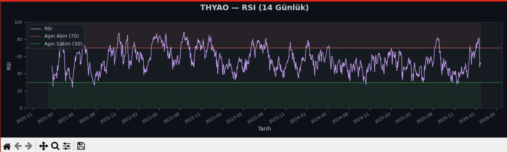
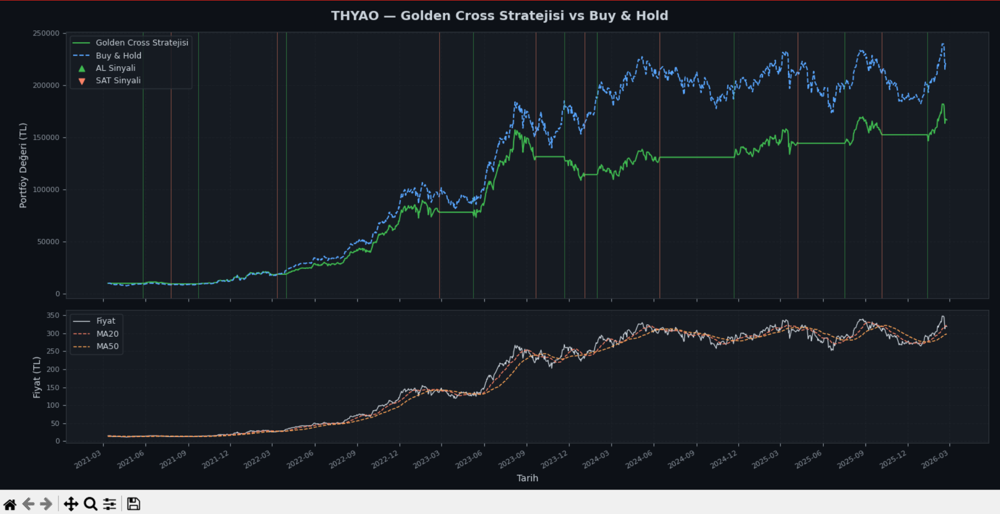
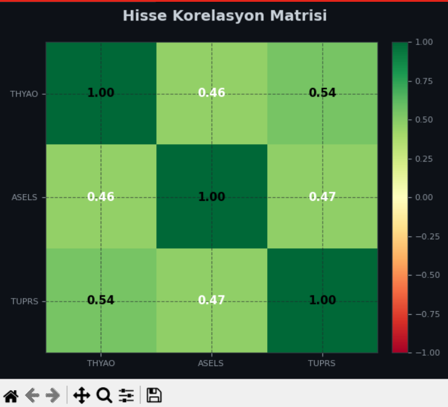

<div align="center">

# 📈 BIST Hisse Senedi Analizi

**Borsa İstanbul hisselerini analiz eden, teknik indikatörler hesaplayan ve al-sat stratejilerini simüle eden Python uygulaması.**


</div>

---

## 📸 Ekran Görüntüleri

### Dashboard

> 📷 *`screenshots/dashboard.png` — Ana pencere: performans tablosu, strateji özeti ve grafik seçim paneli*



---

### Kümülatif Getiri Karşılaştırması

> 📷 *`screenshots/cumulative_returns.png` — THYAO, ASELS ve TUPRS normalize kümülatif getiri*



---

### Fiyat + Hareketli Ortalama + Bollinger Bantları

> 📷 *`screenshots/price_ma_bollinger.png` — Fiyat, MA20, MA50 ve Bollinger Bantları*



---

### RSI Göstergesi

> 📷 *`screenshots/rsi.png` — 14 günlük RSI, aşırı alım/si



---

### Golden Cross Al-Sat Stratejisi

> 📷 *`screenshots/strategy.png` — Golden Cross stratejisi vs Buy & Hold portföy karşılaştırması*



---

### Korelasyon Isı Haritası

> 📷 *`screenshots/correlation.png` — Hisseler arası getiri korelasyonu*



---

## 🚀 Özellikler

| Kategori | Özellik |
|---|---|
| **Veri** | Investing.com & Yahoo Finance CSV desteği |
| **Teknik İndikatörler** | MA20, MA50, Bollinger Bantları, RSI (14) |
| **Risk Metrikleri** | Volatilite, Sharpe Ratio, Max Drawdown |
| **Portföy** | Kümülatif getiri, korelasyon matrisi |
| **Al-Sat** | Golden Cross stratejisi & Buy & Hold karşılaştırması |
| **Arayüz** | Dark-themed Tkinter dashboard — istediğin grafiği aç |

---

## 📁 Proje Yapısı

```
mini-bist-portfolio-analysis/
│
├── app.py               
├── main.py             
├── requirements.txt
├── README.md
│
├── data/
│   ├── THYAO.csv
│   ├── ASELS.csv
│   └── TUPRS.csv
│
├── screenshots/         
│
└── src/
    ├── data_loader.py  
    ├── returns.py      
    ├── portfolio.py    
    └── visualization.py
```

---

## ⚙️ Kurulum

```bash
pip install -r requirements.txt
```

---

## ▶️ Kullanım

### İnteraktif Dashboard (Önerilen)

```bash
python app.py
```

Açılan pencerede sağ panelden istediğin grafiği seçip açabilirsin.

### CLI Modu

```bash
python main.py
```

Grafikler sırayla otomatik açılır.

---

## � Teknik İndikatörler

| İndikatör | Parametre | Açıklama |
|---|---|---|
| MA20 | 20 gün | Kısa vadeli hareketli ortalama |
| MA50 | 50 gün | Uzun vadeli hareketli ortalama |
| Bollinger Bantları | 20 gün, 2σ | Fiyat volatilite kanalı |
| RSI | 14 gün (Wilder) | 70 → aşırı alım · 30 → aşırı satım |
| Sharpe Ratio | 252 işlem günü | Risk-düzeltmeli yıllık getiri |
| Max Drawdown | — | En büyük tepe-çukur kaybı |

---

## ⚡ Golden Cross Stratejisi

| Sinyal | Kural | Aksiyon |
|---|---|---|
| **AL** | MA20 > MA50 (yukarı kesiş) | Nakit → Hisse |
| **SAT** | MA20 < MA50 (aşağı kesiş) | Hisse → Nakit |

Sonuçlar **Buy & Hold** ile karşılaştırılır.

---

## 🔧 Yeni Hisse Ekleme

1. `data/HISSE.csv` dosyasını ekle (Investing.com formatı)
2. `app.py` ve `main.py` içindeki `STOCK_NAMES` listesini güncelle:

```python
STOCK_NAMES = ["THYAO", "ASELS", "TUPRS", "HISSE"]
```

---

## 📦 Bağımlılıklar

| Paket | Kullanım |
|---|---|
| `pandas` | Veri işleme |
| `numpy` | Sayısal hesaplama |
| `matplotlib` | Grafik |
| `scipy` | KDE (getiri dağılımı) |

---

> **⚠️ Uyarı:** Bu proje yalnızca eğitim amaçlıdır. Gerçek yatırım kararları için profesyonel danışmanlık alınız.
